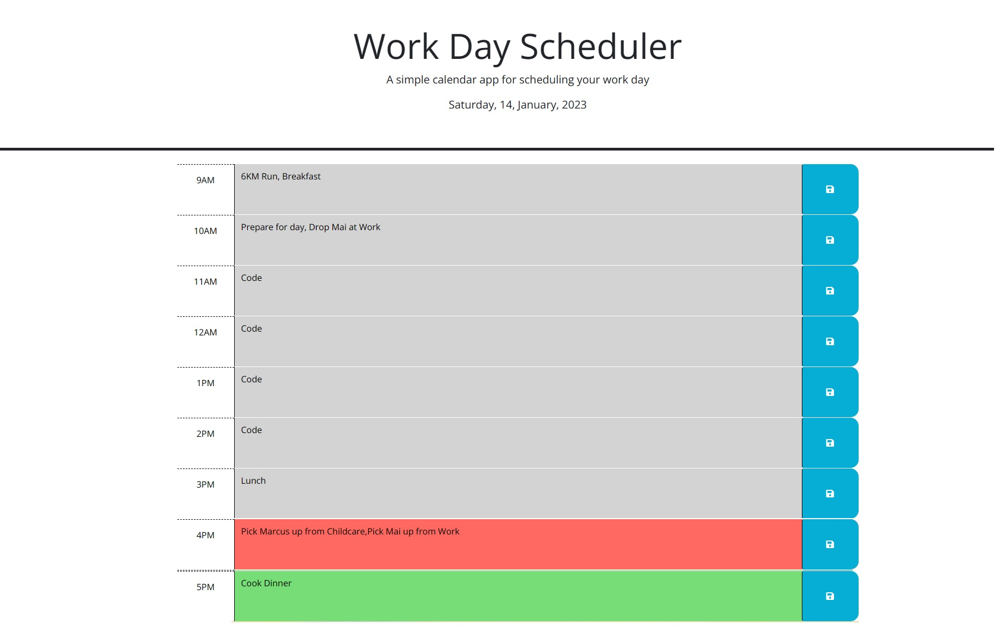

# busy-employee-scheduler-workday

## Description

The motivation behind this project was to practice and implement the basic techniques, usage and methods of third-party APIs that we looked at throughout the unit by adding functionality to a work planner. This would require the use of DayJS for the time component and Jquery for ease of DOM manipulation. I learnt a huge amount during construction of this project including more about the use of CDNs, methods of selection with jQuery, usage of DayJS, more about local storage and the most efficient ways to utilise it, ideas to take advantage of custom data-attributes when designing functions and JSON methods. Whilst, my understanding and implementation of these concepts within this challenge were not perfect, I feel as though I have progressed significantly since I started on it.

## Table of Contents

- [Description](#description)
- [Usage](#usage)
- [Deployment](#deployment)
- [Credits](#credits)
- [License](#license)

## Installation

N/A

## Usage

This application functions as a daily hour-by-hour schedule. It's functionality includes colour changes to reflect whether the hour has passed, is current, or is yet to come.
It also includes variosu text area, in which the user may type events that should be attended to within that hour of the day.
On hitting the save button on the right of the page, the item is saved into local storage and will still be visible when the window is closed and opened again.
If more than one item is required for an hour block the text area should be erased before adding the second item. Both will be visible on refresh.

Screenshot:

## Deployment

https://tvml24.github.io/busy-employee-scheduler-workday/

## Credits

This project featured the use of starter-code that was not mine. That said, I have modified the html and javascript extensively. 

I have used jQuery and DayJS in my own modifications.

Credit also to my teachers.

## License

Licensed under the MIT license.

